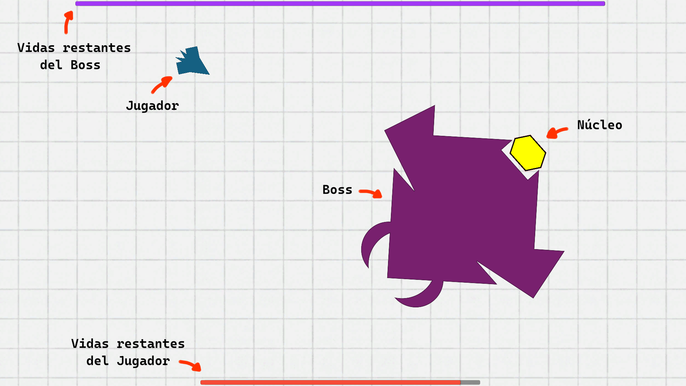

# Polygon Nova

A 2D arena shooter built in Unity, inspired by the classic arcade game *Asteroids*. The player pilots a spaceship in a single, escalating boss fight against a powerful alien vessel with multiple attack patterns.

## Overview

- **Genre:** Arena Shooter / Boss Rush
- **Engine:** Unity (C#)
- **Platform:** PC (Windows)
- **Team:** Dazhan Hong, Kai Xu

There are no traditional levels — the entire game is a single boss encounter divided into 4 phases. As the boss's health drops, it becomes more likely to use its strongest attacks (Dash, Continuous Laser, Bullet Rain, Lightning, Black Hole), progressively increasing the difficulty.

## Gameplay

- Movement is mouse-oriented: the ship always faces the cursor and moves forward with the spacebar.
- The boss has a destructible core; breaking it lets the player upgrade their weapon.
- Four weapon types: default Bullets, chargeable Energy Ball, melee Dual Swords, and Corrosion Mines.
- The map wraps around: leaving one edge brings the ship back on the opposite side.

## Controls

| Input | Action |
|---|---|
| Mouse movement | Aim / orient the ship |
| Left click | Fire weapon |
| Right click | Select new weapon (after destroying the core) |
| Space | Thrust forward |
| Esc | Pause menu |

## How to Play
 
1. Go to the [Releases](https://github.com/SaltHeart2/PolygonNova/releases/tag/Version1.0) page.
2. Download the latest `.zip` build.
3. Extract it and run the executable.